# c++

[TOC]

# [鱼C-小甲鱼](https://space.bilibili.com/314076440)

【C++语法】《C++快速入门》】 https://www.bilibili.com/video/BV1Ps411w73m/?share_source=copy_web&vd_source=58db31bb901367e4980bd3490472e78c

- [x] 1
- [x] 2
- [x] 3
- [x] 4
- [x] 5
- [x] 6
- [x] 7
- [x] 8
- [x] 9
- [x] 10
- [x] 11
- [x] 12
- [x] 13
- [x] 14
- [x] 15
- [x] 16
- [x] 17
- [x] 18
- [x] 19
- [x] 20
- [x] 21
- [x] 22
- [x] 23
- [x] 24
- [x] 25
- [x] 26
- [ ] 27
- [ ] 28
- [ ] 29
- [ ] 30

# 1.头文件

## 1.1"iostream"  (input&output stream)

```c++
#include<iostream>
```

常见用途
输入流 " cin>> " 和 输出流 " cout<< " ，后面接的数据类型可以是int,float,double,string等，相当方便，推荐使用.

## 1.2"stdio.h"  (standard buffered input&output)

```
#include<stdio.h>
```

这本来是C语言标准函数库中的头文件，到C++中就变成了 "cstdio" (两者其实差不多).
常见用途
格式化输入 "scanf()" 和格式化输出 "printf()" ，功能丰富，但是相比起"cin"和"cout"略显繁琐，
也是非常好用的头文件.

## 1.3."cmath" ( "math.h" )

```
#include<cmath>
```

和"cstdio"一样，"cmath"的“前身”是C语言标准函数库中的头文件"math.h"，包含了大量的数学公式，方便计算.

## 1.4."windows.h"

```c++
#include<windows.h>
```

这是个神奇的头文件，可以自行探索.（说白了就是我也了解得比较少）
常见用途 
"GetAsyncKeyState()()"判断某个键是否被按下.
"system("cls")" 清空屏幕.
"Sleep()" 延迟（单位：毫秒）.

## 1.5."algorithm"

```
#include<algorithm>
```

这是C++的标准算法库
常见用途
求最大值 "max()" , 求最小值 "min()" ，排序函数 "sort()" 等

## 1.6."string" "string.h" "cstring"

```c++
#include<string>
#include<string.h>
#include<cstring>
```

这三个都是有关字符串使用的头文件
主要用途
数组初始化函数 "memset()" 插入字符串"insert()" , 去除字符串"erase()" 等

## 1.7."bits/stdc++.h"

```
#include<bits/stdc++.h>
```

它被称为C++的“万能头文件”, 足见其有多么强大，但是我没有将它放在前面，是因为它的缺点也非常明显——会大大拖慢程序运行速度. 这个头文件几乎包含了所有C++的库函数，

# 2.数据类型

## 2.1 整型

作用：整型变量表示整数类型的数据。
C++中共有4种表示整型的类型，区别在于所占内存空间和可表示的取值范围不同。
注：实际开发中，较多使用int类型表示整型数据，占用空间大小为4字节。

|      数据类型       |                    占用空间                     |     取值范围     |
| :-----------------: | :---------------------------------------------: | :--------------: |
|   short(短整型）    |                      2字节                      | (-2^15 ~ 2^15-1) |
|      int(整型)      |                      4字节                      | (-2^31 ~ 2^31-1) |
|    long(长整形)     | Windows为4字节，Linux为4字节(32位)，8字节(64位) | (-2^31 ~ 2^31-1) |
| long long(长长整形) |                      8字节                      | (-2^63 ~ 2^63-1) |

## 2.2 sizeof关键字

作用：sizeof关键字可统计数据类型所占用的内存大小
语法：sizeof(数据类型) 或 sizeof(变量名)

## 2.3 浮点型（实型）

作用：浮点型变量表示小数类型的数据。
浮点型变量分为两种，区别在于表示的有效数字范围不同。
（1）单精度float：4字节
（2）双精度double：8字节

| 数据类型 | 占用空间 | 有效数字范围     |
| :------: | :------: | :--------------- |
|  float   |  4字节   | 7位有效数字      |
|  double  |  8字节   | 15～16位有效数字 |

## 2.4 字符型

C和C++语言中，字符型变量只占用1个字节。
字符型变量是将对应的ASCII编码存放至内存，而不是字符本身。
作用：字符型变量可表示单个字符。
语法：char ch = 'a';

| 数据类型 | 占用空间 |
| :------: | :------: |
|   char   |    1     |


## 2. 5字符串型

作用：表示一串字符（可以输入中文）
（1）C风格字符串： char 变量名[] = "字符串值";
（2）C++风格字符串： string 变量名 = "字符串值";

## 2.6 布尔类型 bool

作用：布尔数据类型表示真或假的值。
bool类型占1个字节大小，且只有两个值：
（1）true： 真（本质是1）
（2）false：假（本质是0）

## 2.7数组

示例

```c++
#include <bits/stdc++.h>
using namespace std;

void add(int a[], int b);

int main()
{
    int a[3];
    for (int i = 0; i < 3; i++)
    {
        /* code */
        while (!(cin >> a[i])) // 如果输入失败进入while循环
        {
            cin.clear();           // 清空接受区
            cin.ignore(100, '\n'); // 取走换行字符
            cout << "请输入合法值(int)类型\n"
                 << endl;
        }
    }
    add(a, 3);
    return 0;
}

void add(int a[], int b) // 将数组作为参数传递
{
    int sum = 0;
    for (int i = 0; i < b; i++)
    {
        sum = sum + a[i];
    }
    cout << "sum==" << sum << endl;
}

```

## 2.8指针

 &为取地址操作符

**含义**

指针是一个变量，用于存储内存地址。它不像普通变量那样直接存储数据值，而是存储了该数据在内存中的位置（地址）。通过指针，可以间接访问和操作该地址上的数据。

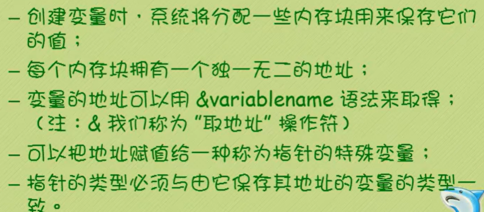

 **解引用**

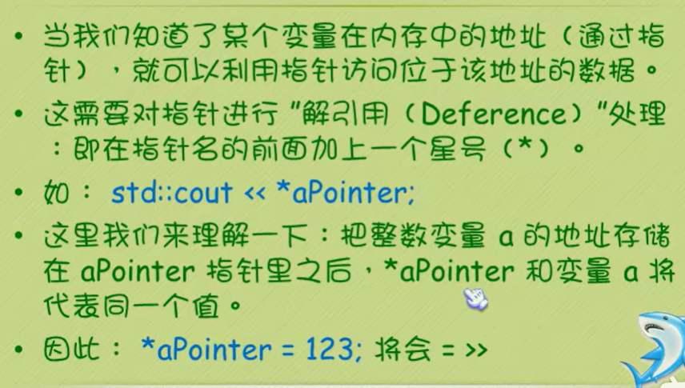

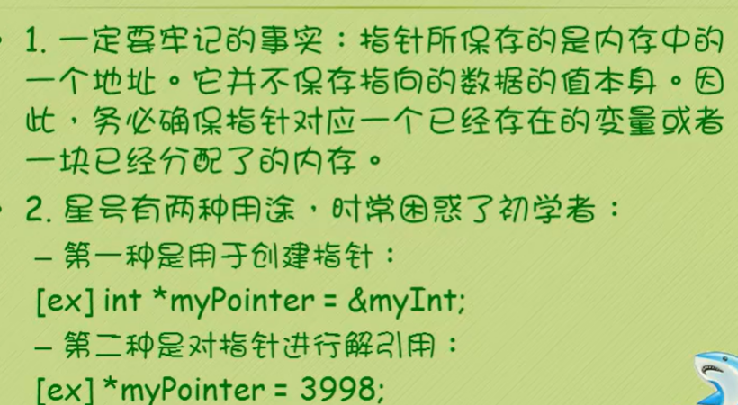


## 2.9指针和数组

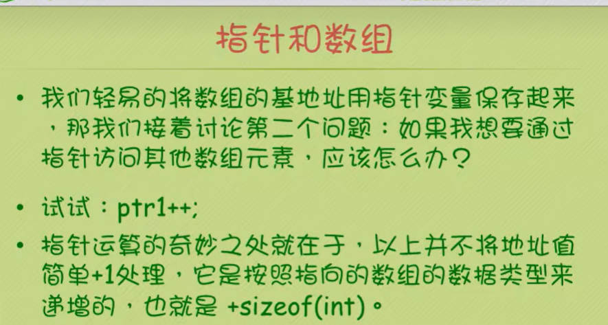

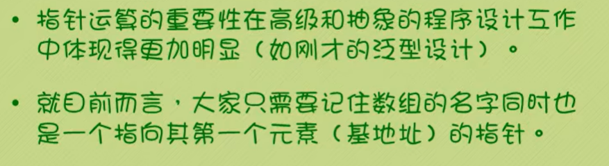

## 2.10结构

 


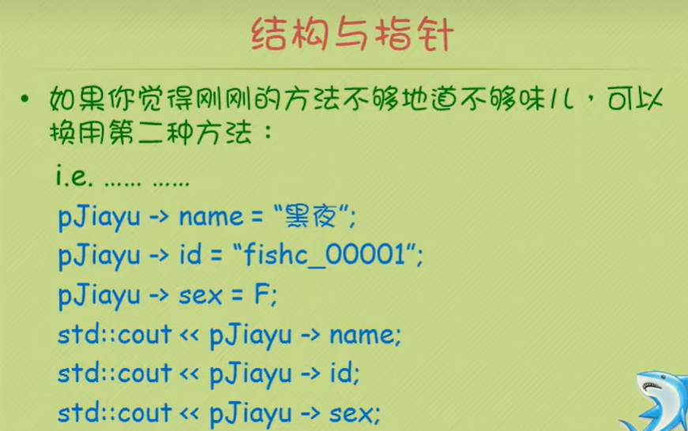

## 2.11联合

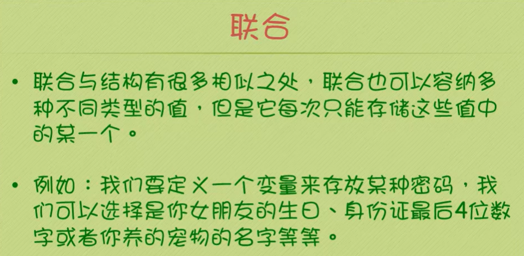

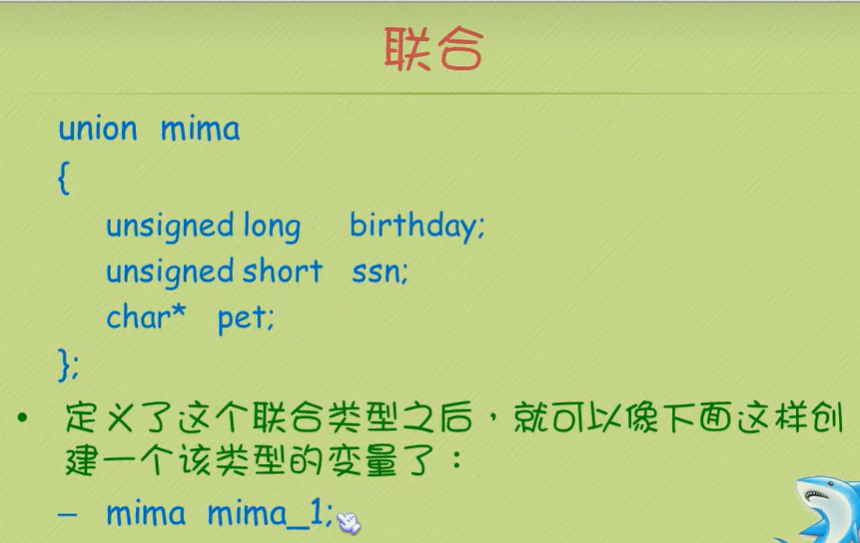

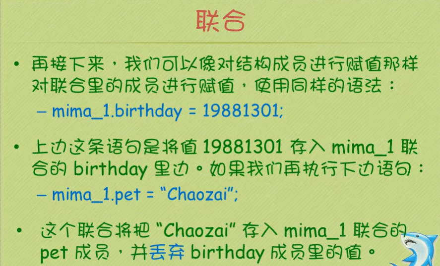


## 2.12枚举

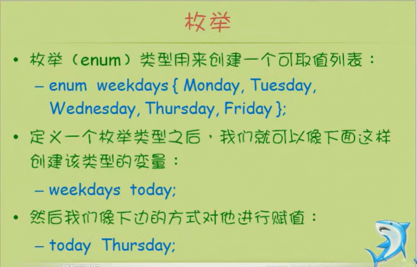

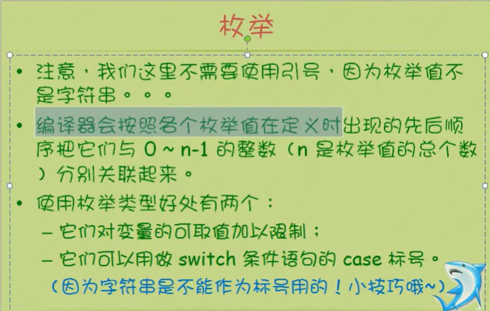


# 3.转义字符

| 转义字符 | 含义                                | ASCII码值（十进制） |
| -------- | ----------------------------------- | ------------------- |
| \a       | 警报                                | 007                 |
| \b       | 退格(BS) ，将当前位置移到前一列     | 008                 |
| \f       | 换页(FF)，将当前位置移到下页开头    | 012                 |
| \n       | 换行(LF) ，将当前位置移到下一行开头 | 010                 |
| \r       | 回车(CR) ，将当前位置移到本行开头   | 013                 |
| \t       | 水平制表(HT) （跳到下一个TAB位置）  | 009                 |
| \v       | 垂直制表(VT)                        | 011                 |
| \\       | 代表一个反斜线字符“\”               | 092                 |
| ’        | 代表一个单引号（撇号）字符          | 039                 |
| "        | 代表一个双引号字符                  | 034                 |
| ?        | 代表一个问号                        | 063                 |
| \0       | 数字0                               | 000                 |
| \ddd     | 8进制转义字符，d范围0~7             | 3位8进制            |
| \xhh     | 6进制转义字符，h范围0-9，a-f，A~ 1F | 3位16进制           |


# 4.ascii值表


# 5常用函数

## 5.1输入输出

示例（cin&&cout.cc）

```c++
#include <bits/stdc++.h>
using namespace std;
int main()
{
     int a;
     cin >> a;
     cout << a << "\n"
          << endl;
     cout << "aaewdaef" << "\n"
          << endl;
     return 0;
}
```

## 5.2输入控制getline（)

在 C++ 中，`getline` 是一个用于从输入流中读取一行字符（包括空格）的函数。

**语法**

- `string & getline (istream &is, string &str);`
- `string & getline (istream &is, string &str, char delim);`

**参数**

- `is`：输入流对象，比如 `cin`。
- `str`：用于存储从输入流中读取的字符序列的字符串对象。
- `delim`：可选参数，指定输入结束的分隔符，默认是换行符 `\n`。

**作用**

- **按行读取输入** ：它可以读取一行完整的输入，包括空格，直到遇到换行符或者其他指定的分隔符。例如，当用户输入一个包含多个单词的句子时，使用 `getline` 可以一次性读取整个句子。
- **控制输入结束条件** ：通过指定分隔符，可以灵活地控制输入的结束条件。比如在处理一些特定格式的数据时，可以指定字符作为分隔符来读取相应的数据段。

**示例**

```c++
#include <iostream>
#include <string>
using namespace std;

int main()
{
    string str;
    cout << "输入一串字符串：";
    // cin >> str;//cin到空格结束
    getline(cin, str);
    cout << str << "\n";
    return 0;
}
```

注意事项

- **处理换行符问题** ：在使用 `cin` 等其他输入函数后，如果直接使用 `getline`，可能会出现读取到空行的情况。这是因为之前的输入操作可能已经将换行符留在了输入缓冲区中。可以通过在使用 `getline` 之前调用 `cin.ignore()` 来解决这个问题。
- **输入验证** ：在实际应用中，需要对输入进行验证，确保读取的内容符合预期的格式和内容要求。例如，可以检查读取到的字符串是否为空，或者是否符合特定的正则表达式模式等。

# 6函数的重载


示例

```c++
#include <bits/stdc++.h>
#include <iostream>

using namespace std;

void add1(int a, int b);
void add1(int a, int b, int c);

int main()
{
    int a = 0, b = 0, c = 0;
    cin >> a >> b >> c;
    add1(a, b);
    add1(a, b, c);

    return 0;
}

void add1(int a, int b)
{
    int x;
    x = a + b;
    cout << "重载A1\n"
         << x << "\n"
         << endl;
}

void add1(int a, int b, int c)
{
    int x;
    x = a + b + c;
    cout << "重载B2\n"
         << x << "\n"
         << endl;
}
```

# 7.对象

##  7.1类 

7.1.1创建类

```c++
class MyFirstClass
{

};
```

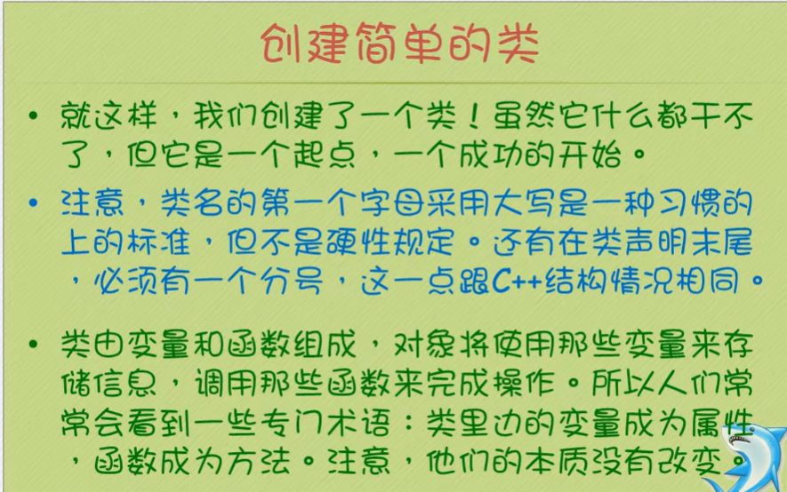

 

## 7.2构造器和析构器

### 7.2.1

### 7.2.2继承机制中的构造器和析构器 

**声明**

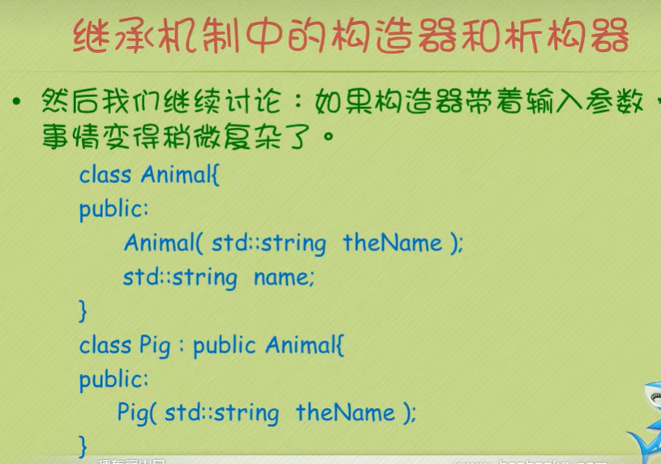

**方法定义**

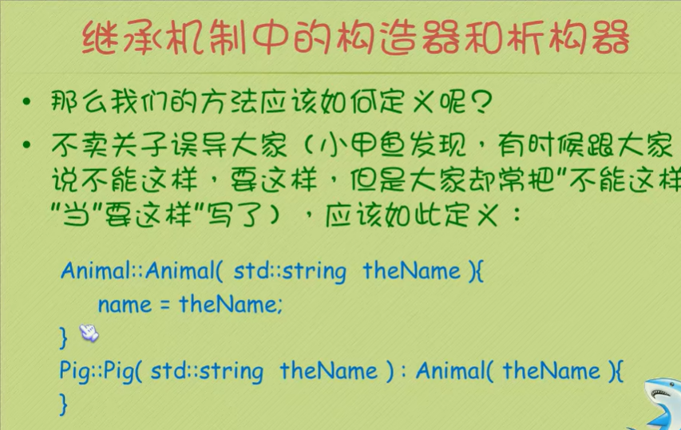

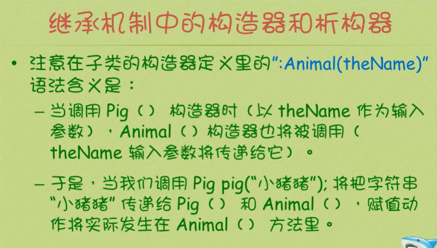


## 7.3子类和基类

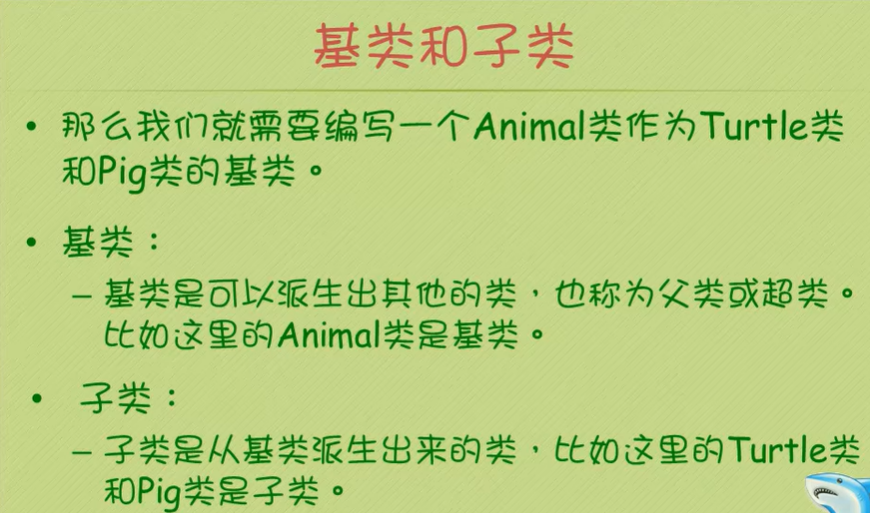

## 7.4静态属性和方法

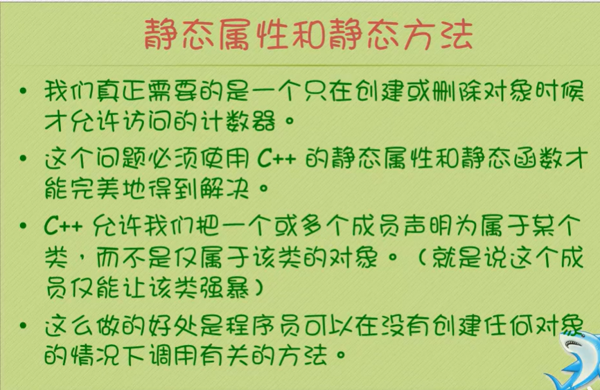
